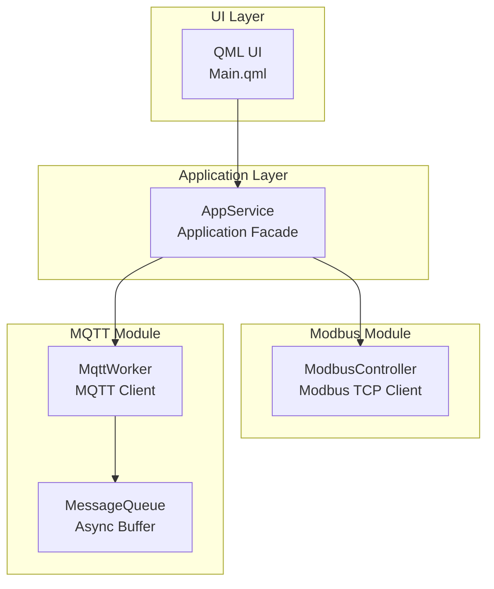

# IoT Gateway (Modbus ⇄ MQTT)

## Overview

This is a training project  for **IoT gateway** that connects **industrial devices via Modbus** to **cloud services via MQTT**.
It is implemented as a **Qt (C++ / QML) application** with a modular and extensible architecture.

The gateway reads data from Modbus devices, processes it internally, and publishes it to an MQTT broker.
The architecture is designed to be **loosely coupled**, **asynchronous**, and **scalable**.

---

## Key Features

- Modbus TCP client for reading and writing registers and coils
- MQTT client (Eclipse Paho) with asynchronous message handling
- Clean modular architecture with explicit boundaries between components
- Centralized application façade (AppService) for UI integration
- Qt Quick (QML) user interface
- CMake‑based multi‑module build system

---

## Architecture

The system follows an **Application Facade** pattern with strict separation of responsibilities.

- `AppService` Central orchestrator that manages module lifecycles, exposes unified API to QML, and routes signals between subsystems.
- `ModbusController` Independent Modbus TCP client responsible for device communication.
  It does not depend on MQTT or MessageQueue.
- `MqttWorker` Thread‑safe queue used only inside MqttWorker to decouple network callbacks from processing logic.
- `MessageQueue` decouples producers and consumers
- `AppService` does **not** generate business data.
  It only coordinates modules and exposes their functionality to QML without performing domain‑level computation.



---

## Project Structure

```
ModbusMaster/
├── CMakeLists.txt
├── main.cpp
├── Main.qml
├── resources.qrc
│
├── modules/
│   ├── appservice/
│   ├── messagequeue/
│   ├── modbuscontroller/
│   ├── mqttworker/
│   └── types/
│
└── ExtLibs/
    ├── paho-mqtt-c/
    └── paho-mqtt-cpp/
```

---

## Module Description

### AppService
- Acts as the central application facade
- Manages lifecycle and configuration of modules
- Receives commands from the UI
- Does **not** produce Modbus or MQTT data
- May issue control commands (start/stop, configuration changes)

### ModbusController
- Communicates with Modbus TCP devices
- Performs asynchronous reading and writing of registers and coils
- Emits signals with received data
- Does not use `MessageQueue`
- Fully encapsulates Modbus protocol logic

### MessageQueue
- Thread‑safe asynchronous buffer
- Used only inside MqttWorker
- Decouples network callbacks from message processing

### MqttWorker
- MQTT client based on Eclipse Paho
- Manages connection, subscription, and publishing
- Uses `MessageQueue` internally for asynchronous message handling
- Does not depend on `ModbusController`

### types
- Common enums, data types, and shared definitions
- Lightweight module used across the entire system
- 
---

## External Libraries

- Eclipse Paho MQTT C
- Eclipse Paho MQTT C++
- Qt SerialBus (for Modbus TCP)

---

## Build Instructions

### Requirements
- Qt 6
- CMake ≥ 3.16
- MinGW64

### Build
```bash
mkdir build
cd build
cmake ..
cmake --build .
```

---

## License

Educational / training project.
