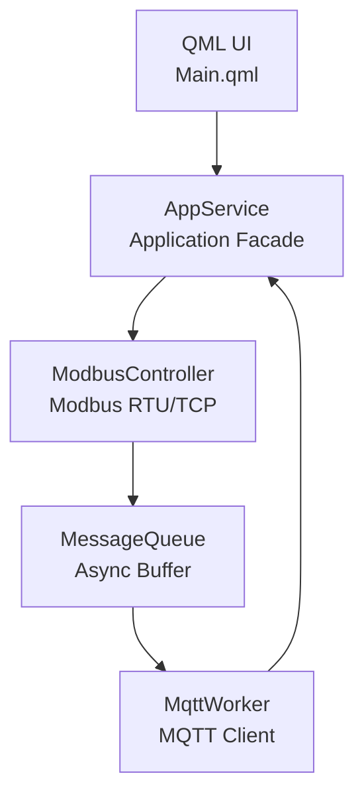

# IoT Gateway (Modbus ⇄ MQTT)

## Overview

This is a training project  for **IoT gateway** that connects **industrial devices via Modbus** to **cloud services via MQTT**.
It is implemented as a **Qt (C++ / QML) application** with a modular and extensible architecture.

The gateway reads data from Modbus devices, processes it internally, and publishes it to an MQTT broker.
The architecture is designed to be **loosely coupled**, **asynchronous**, and **scalable**.

---

## Key Features

- Modbus TCP data acquisition
- MQTT client based on Eclipse Paho
- Modular architecture with clear separation of responsibilities
- Message-based communication between modules
- Qt Quick (QML) user interface
- CMake-based build system

---

## Architecture

The system follows an **Application Facade** pattern.

- `AppService` orchestrates the system and controls module lifecycles
- `ModbusController` produces data
- `MqttWorker` consumes data
- `MessageQueue` decouples producers and consumers
- `AppService` does **not** generate business data



---

## Project Structure

```
ModbusMaster/
├── CMakeLists.txt
├── main.cpp
├── Main.qml
├── resources.qrc
│
├── modules/
│   ├── appservice/
│   ├── messagequeue/
│   ├── modbuscontroller/
│   └── mqttworker/
│
└── ExtLibs/
    ├── paho-mqtt-c/
    └── paho-mqtt-cpp/
```

---

## Module Description

### AppService
- Acts as the central application facade
- Manages lifecycle and configuration of modules
- Receives commands from the UI
- Does **not** produce Modbus or MQTT data
- May issue control commands (start/stop, configuration changes)

### ModbusController
- Communicates with Modbus TCP devices
- Periodically reads registers
- Produces data messages and pushes them to `MessageQueue`

### MessageQueue
- Asynchronous transport between modules
- Decouples data producers and consumers

### MqttWorker
- Consumes messages from `MessageQueue`
- Publishes data to MQTT broker

---

## External Libraries

- Eclipse Paho MQTT C
- Eclipse Paho MQTT C++

---

## Build Instructions

### Requirements
- Qt 6
- CMake ≥ 3.16
- MinGW64

### Build
```bash
mkdir build
cd build
cmake ..
cmake --build .
```

---

## License

Educational / training project.
