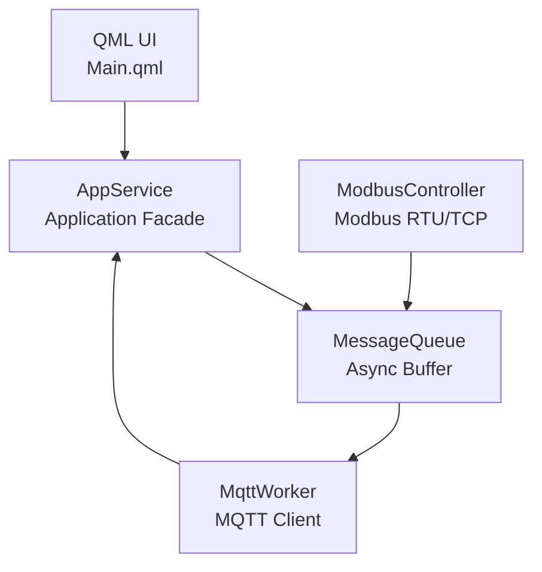

# IoT Gateway (Modbus ⇄ MQTT)

## Overview

This is a training project  for **IoT gateway** that connects **industrial devices via Modbus** to **cloud services via MQTT**.
It is implemented as a **Qt (C++ / QML) application** with a modular and extensible architecture.

The gateway reads data from Modbus devices, processes it internally, and publishes it to an MQTT broker.
The architecture is designed to be **loosely coupled**, **asynchronous**, and **scalable**.

---

## Key Features

- Modbus RTU / TCP data acquisition
- MQTT client based on Eclipse Paho
- Modular architecture with clear separation of responsibilities
- Message-based communication between modules
- Qt Quick (QML) user interface
- CMake-based build system

---

## Architecture



---

## Project Structure

```
ModbusMaster/
├── CMakeLists.txt
├── main.cpp
├── Main.qml
├── resources.qrc
│
├── modules/
│   ├── appservice/
│   ├── messagequeue/
│   ├── modbuscontroller/
│   └── mqttworker/
│
└── ExtLibs/
    ├── paho-mqtt-c/
    └── paho-mqtt-cpp/
```

---

## Module Description

### AppService
Central coordination component of the application.

### MessageQueue
Asynchronous message buffer between modules.

### ModbusController
Low-level interface to Modbus devices.

### MqttWorker
MQTT client responsible for cloud communication.

---

## External Libraries

- Eclipse Paho MQTT C
- Eclipse Paho MQTT C++

---

## Build Instructions

### Requirements
- Qt 6
- CMake ≥ 3.16
- MinGW64

### Build
```bash
mkdir build
cd build
cmake ..
cmake --build .
```

---

## License

Educational / training project.
